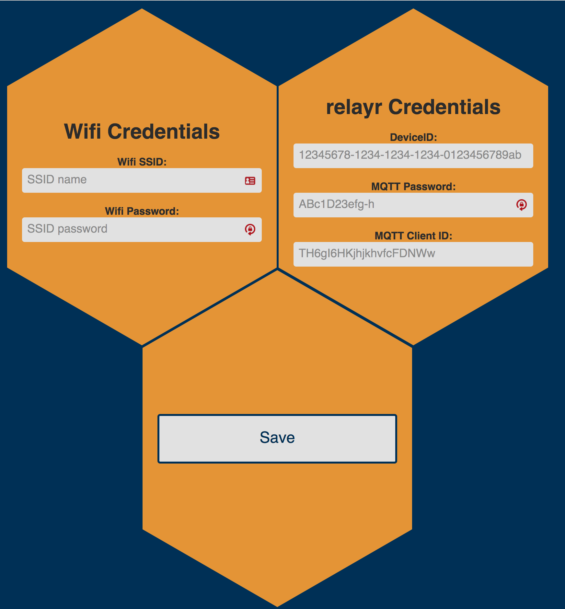

# Save the Bees! for ESP8266 (WeMos D1 Mini)

## Introduction
<!--A brief description of the purpose and functionality of the project.-->
*Save the Bees!* is an Open Source project that is used to track the status of a beehive through a microcontroller and some sensors.

The following version is the entry-level one and it is intended for the the ESP8266 microcontroller running the Arduino framework.

Following the steps of this guide you can start quickly tracking your beehive and get the status of it.

## Requirements
<!--A list of all system requirements and required third-party components.-->

### Hardware
This is your shopping list:

- Board: [WeMos D1 Mini](https://www.wemos.cc/product/d1-mini.html)
- Analog Multiplexer: [CD74HC4052E](http://www.ti.com/lit/gpn/CD74HC4052) by Texas Instruments
- RTC module: either [DS1307](https://www.maximintegrated.com/en/products/digital/real-time-clocks/DS1307.html) or [DS3231](https://www.maximintegrated.com/en/products/digital/real-time-clocks/DS3231.html) based modules are compatible
- Temperature module: [AM2315](http://www.aosong.com/en/products/details.asp?id=121) by Aosong
- Compression load cells: 4x [FC2231-0000-0100-L](http://www.te.com/usa-en/product-CAT-FSE0001.html) by Measurement Specialities

### Software
The Software used for this project and the source code of the project itself are open source and then free to use:

- USBtoUART drivers
- [PlatformIO](http://platformio.org/) IDE or [Arduino](https://www.arduino.cc/) IDE with support for the WeMos D1 Mini board
- Adafruit AM2315 [Library](https://github.com/adafruit/Adafruit_AM2315)
- Adafruit RTClib [Library](https://github.com/adafruit/RTClib)
- PubSubClient [Library](https://github.com/uberdriven/pubsubclient), an Arduino client for MQTT protocol, modified with an increased packet size of 512 bytes
- Arduino JSON [Library](https://github.com/bblanchon/ArduinoJson)


## Installation & Configuration
<!--Step-by-step instructions, with proper punctuation, on how to install and configure the project.-->
In order to compile the script and upload it to the board, you have to follow the next steps:

### 1) Download the CH340 USB to UART drivers
The drivers are necessary to communicate with the serial port on a device via USB. You can download the them from [here](https://www.wemos.cc/downloads/) for Windows or macOS. GNU/Linux systems do not need any driver.

NOTE: If you have **macOS Sierra** (10.12.x) and you never installed any CH34x drivers before, you must download [this](http://blog.sengotta.net/wp-content/uploads/2015/11/CH34x_Install_V1.3.zip) driver, otherwise if you had already a previous version installed follow [this](https://github.com/adrianmihalko/ch340g-ch34g-ch34x-mac-os-x-driver) guide.

To be sure that your drivers are currently working, connect the WeMos D1 Mini to your computer via USB, open a terminal window and type `ls /dev/cu.*` (in macOS). You should find between the devices connected something similar to `/dev/cu.wchusbserial1410`.

### 2) Install Python
Python is necessary because the compiler for the ESP8266 (on which the WeMos D1 mini is based) runs a set of commands in Python. Python comes by default with macOS and GNU/Linux, to check if it is installed, just open a terminal window and digit `python -V`. While Windows users should [download](https://www.python.org/downloads/) and install it manually.

### 3) Set up your IDE
There are two main options where to edit the script, send the code to the board and monitor the serial output: Arduino IDE or PlatformIO.

#### PlatformIO
PlatformIO is an open source ecosystem for IoT development. It brings many useful features as code auto completion, a smart library manager and others. Is is available as *core* version (command line interface) and as a plugin for many popular IDEs and text editors. It supports natively many platforms, frameworks and boards. The easiest way to start with PlatformIO is [download](http://platformio.org/get-started/ide) the PlatformIO IDE (Atom text editor with already the PlatformIO core and plugins installed).

#### Arduino IDE
The Arduino IDE is the native software for developing programs for Arduino and compatible boards.

- Download it for [Windows](https://www.arduino.cc/en/Guide/Windows), [macOS](https://www.arduino.cc/en/Guide/MacOSX) or [GNU/Linux](https://www.arduino.cc/en/Guide/Linux)
- Once downloaded and installed, open the `preferences` tab, and into the `Additional Board Manager` field insert `http://arduino.esp8266.com/stable/package_esp8266com_index.json`. The field can support multiple URLs separated with commas
- Open `Tools` → `Board: xxx` → `Boards Manager` and install *esp8266* by *ESP8266 Community*
- Select the right board:  `Tools` → `Board: xxx` and select `WeMos D1 R2 Mini`
- Select the right upload speed: `Tools` → `Upload Speed` → `115200`

### 4) Install the required libraries

#### With PlatformIO
Platformio provides a very good [library manager](http://platformio.org/lib) and it is very easy add a new library for a project. Open Atom, then `PlatformIO` tab → `Terminal` → `Toggle` and type:

```
pio lib -g install 773
```
this command install the Adafruit AM2315 Library,

```
pio lib -g install 64
```
this command install the Arduino JSON library,

```
pio lib -g install 83
```
this command install the Adafruit RTClib Library,

```
pio lib -g install https://github.com/uberdriven/pubsubclient
```
this command install the PubSubClient modified library.


#### With Arduino IDE
First you should download the four libraries from GitHub, then open the Arduino IDE, `Sketch` tab → `Include Library` → `Add .ZIP library` and select the downloaded libs one by one. For an extended explanation, check the Arduino [guide](https://www.arduino.cc/en/Guide/Libraries) how to include libraries.

### 5) Connect the componets
Connect the components as in the Fritzing generated PDF schema in this repo.

NOTE: if you use a DS1307 RTC, you should provide it 5V, while for a DS3231 RTC it is enough use the 3.3V.

### 6) Flash the program on your board
TO-DO


Connect your WeMos D1 Mini to your computer via USB. Now you can copy and paste from this repository the last version of the code.

For now, the only two parameters you can modify are:

- the `SLEEP_TIME`, that is the number of seconds for 
- the model of RTC used
- the `ACCESS_POINT_PWD`, that is the password of the setup mode, the default one is *BeeHive91*


### 7) Create your device on relayr Dashboard

### 8) Insert your Wi-Fi and relayr credentials
Turn on the board into the Setup Mode. It will create a Wi-Fi Access Point called `BeeSetup` using both the 2.4GHz and the 5GHz frequency bands. From your computer connect to that network using the password defined in the step 6 of this document. Then open your browser and in the URL field digit `192.168.1.4` and connect. You will see the following page:



Enter first the Wi-Fi credentials of your Access Point connected to the Internet, then the relayr credentials you got from step 7 of this guide and finally press on the Save button. If in future you will have to change your parameters, just follow again this step.

### 9) Set the tare

Now digit in your browser the address `192.168.1.4/tare`. You will see the following page:


When you will press the `Set New Tare` button the current weight on the loadcell will be considered the point zero.

### 10) (Optional) Display the beehive sensors readings with Grafana


## To-Do

- Add a switch to enter in setup mode easier
- Add configurations/commands/QoS support
- Build the base and hardware
- Add 5th loadcell support
- Add external ADC

## License
<!--The license under which the software will be released. Open-source projects MUST include the MIT License, and closed-source projects MUST include a proprietary license to be discussed with the Documentation team.
-->
The MIT License (MIT)
Copyright (c) 2017 relayr Inc., Riccardo Marconcini [riccardo DOT marconcini AT relayr DOT de](mailto:riccardo.marconcini@relayr.de)

Permission is hereby granted, free of charge, to any person obtaining a copy of this software and associated documentation files (the "Software"), to deal in the Software without restriction, including without limitation the rights to use, copy, modify, merge, publish, distribute, sublicense, and/or sell copies of the Software, and to permit persons to whom the Software is furnished to do so, subject to the following conditions:

The above copyright notice and this permission notice shall be included in all copies or substantial portions of the Software.

THE SOFTWARE IS PROVIDED "AS IS", WITHOUT WARRANTY OF ANY KIND, EXPRESS OR IMPLIED, INCLUDING BUT NOT LIMITED TO THE WARRANTIES OF MERCHANTABILITY, FITNESS FOR A PARTICULAR PURPOSE AND NONINFRINGEMENT. IN NO EVENT SHALL THE AUTHORS OR COPYRIGHT HOLDERS BE LIABLE FOR ANY CLAIM, DAMAGES OR OTHER LIABILITY, WHETHER IN AN ACTION OF CONTRACT, TORT OR OTHERWISE, ARISING FROM, OUT OF OR IN CONNECTION WITH THE SOFTWARE OR THE USE OR OTHER DEALINGS IN THE SOFTWARE.